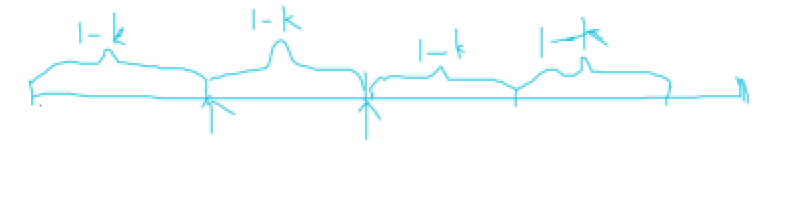

## 6131. 不可能得到的最短骰子序列

给你一个长度为 `n` 的整数数组 `rolls` 和一个整数 `k` 。你扔一个 `k` 面的骰子 `n` 次，骰子的每个面分别是 `1` 到 `k` ，其中第 `i` 次扔得到的数字是 `rolls[i]` 。

请你返回 **无法** 从 `rolls` 中得到的 **最短** 骰子子序列的长度。

扔一个 `k` 面的骰子 `len` 次得到的是一个长度为 `len` 的 **骰子子序列** 。

**注意** ，子序列只需要保持在原数组中的顺序，不需要连续。

 

**示例 1：**

```
输入：rolls = [4,2,1,2,3,3,2,4,1], k = 4
输出：3
解释：所有长度为 1 的骰子子序列 [1] ，[2] ，[3] ，[4] 都可以从原数组中得到。
所有长度为 2 的骰子子序列 [1, 1] ，[1, 2] ，... ，[4, 4] 都可以从原数组中得到。
子序列 [1, 4, 2] 无法从原数组中得到，所以我们返回 3 。
还有别的子序列也无法从原数组中得到。
```

**示例 2：**

```
输入：rolls = [1,1,2,2], k = 2
输出：2
解释：所有长度为 1 的子序列 [1] ，[2] 都可以从原数组中得到。
子序列 [2, 1] 无法从原数组中得到，所以我们返回 2 。
还有别的子序列也无法从原数组中得到，但 [2, 1] 是最短的子序列。
```

**示例 3：**

```
输入：rolls = [1,1,3,2,2,2,3,3], k = 4
输出：1
解释：子序列 [4] 无法从原数组中得到，所以我们返回 1 。
还有别的子序列也无法从原数组中得到，但 [4] 是最短的子序列。
```

 

**提示：**

- `n == rolls.length`
- `1 <= n <= 105`
- `1 <= rolls[i] <= k <= 105`


#### 算法及思路

如果想找到长度为一的则1到k都要出现过，这个区间内最后一个元素就是最晚出现的元素即包含1-k的最后一个出现的元素，长度为二的肯定在这个数后面找，也即第二段也需要找到最晚的一个数使得第二个区间包含1-k,依次类推，看能找到几段就可以得出答案。



#### 代码

```C++
class Solution {
public:
    int shortestSequence(vector<int>& rolls, int k) {
        int n = rolls.size();
        int cnt=0;
        unordered_set<int> hash;
        for(int i=0;i<n;i++){
            int j=i;
            while(j<n&&hash.size()<k){
                hash.insert(rolls[j]);
                j++;
            }
            if(hash.size()==k) cnt++;
            hash.clear();
            i=j-1;
            
        }
        return cnt+1;
    }
};
```


